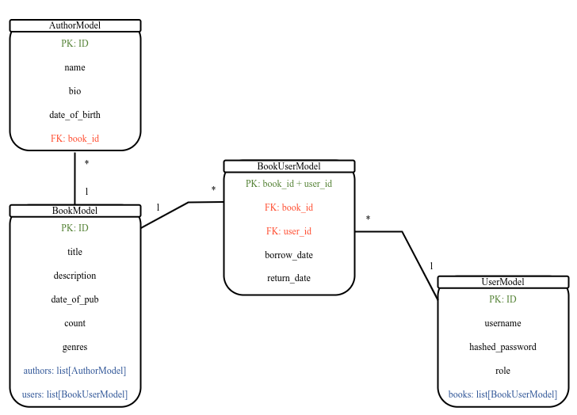
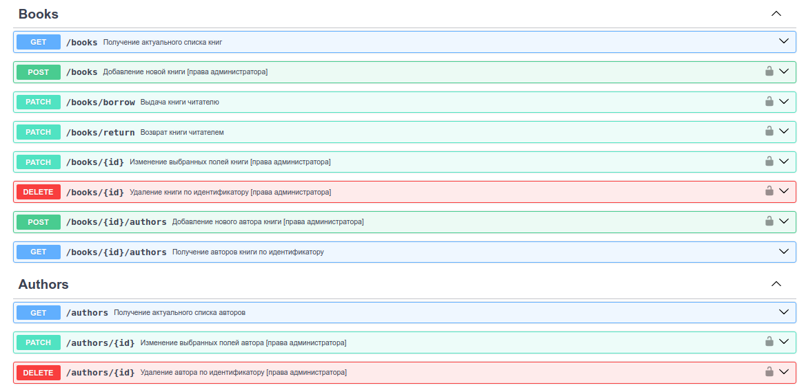

### RESTful API для управления каталогом библиотеки

#### [Техническое задание](./spec.md)

#### UML диаграмма SQL базы данных

#

#### Запуск приложения при помощи Docker

- git clone https://github.com/darialissi/fastapi-library.git

- cd fastapi-library && docker-compose up
#

Документация доступна на http://127.0.0.1:8000/docs 

