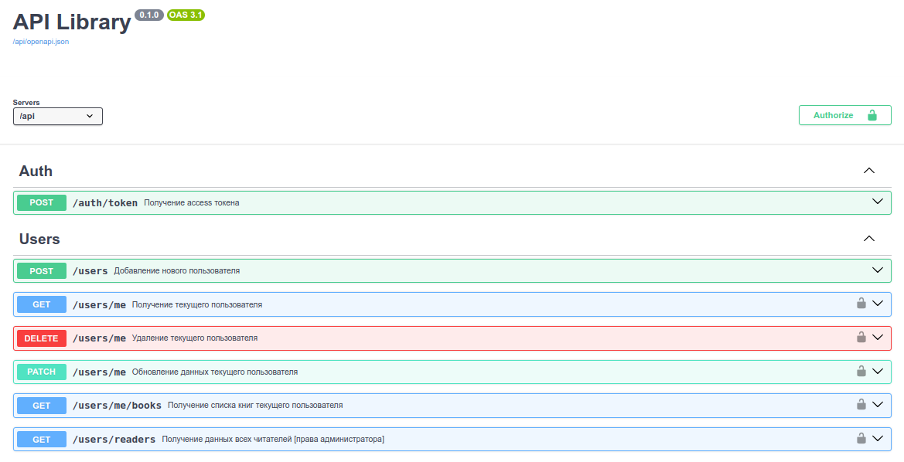

### RESTful API для управления каталогом библиотеки

#### [Техническое задание](./spec.md)

#### UML диаграмма SQL базы данных

#

#### Запуск приложения при помощи Docker (docker compose v2)

- *git clone https://github.com/darialissi/fastapi-library.git*

- *cd fastapi-library && docker compose --profile prod up*
#

Документация доступна на *http://127.0.0.1:8000/docs*

#

#### Тестирование

1. Поднимаем postgres и redis
   
   *docker compose --profile test up -d*

2. Устанавливаем poetry

   *pip install poetry*

3. Подтягиваем зависимости
   
   *poetry install --no-root*

4. Запускаем pytest
   
   *poetry run pytest*